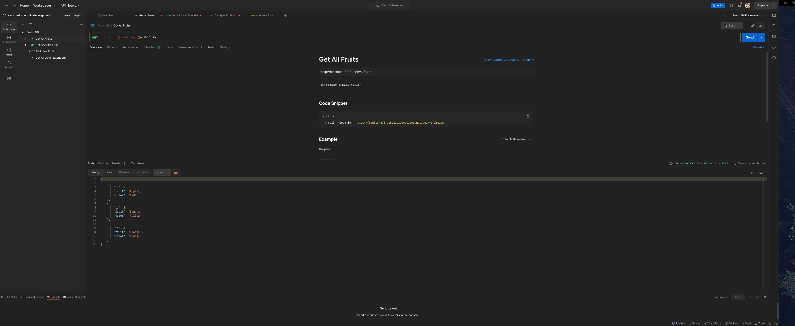
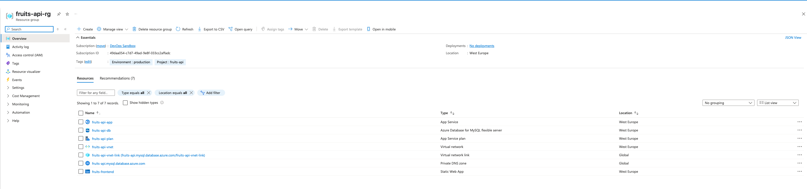

# Fruits API

A simple RESTful API for managing fruits, built with FastAPI and SQLite, with a modern Next.js frontend.

## Features

- Get all fruits
- Get a specific fruit by ID
- Persistent storage using SQLite
- Containerized application
- CI/CD pipeline with GitHub Actions
- Modern Next.js frontend with Material UI

## Prerequisites

- Python 3.11+
- Node.js 18+
- Docker (optional)

## Local Development Setup

1. Clone the repository:
```bash
git clone <repository-url>
```

2. Create and activate a virtual environment:
```bash
python -m venv venv
source venv/bin/activate  # On Unix/macOS
```

3. Install dependencies:
```bash
pip install -r requirements.txt
```

4. Run the backend application:
```bash
uvicorn app.main:app --reload
```

The API will be available at `http://localhost:8000`

5. Run the frontend application:
```bash
cd fruits-frontend
npm install
npm run dev
```

The frontend will be available at `http://localhost:3000`

## Running with Docker

1. Build the Docker image:
```bash
docker build -t fruits-api .
```

2. Run the container:
```bash
docker run -p 8000:8000 fruits-api
```

### API Endpoints

#### GET /api/v1/fruits
Returns all fruits in the database.



#### GET /api/v1/fruits/{fruit_id}
Returns a specific fruit by ID.


#### GET /api/v1/data
Returns all data including fruits, suppliers, and nutritional information.


Example response:
```json
{
    "fruits": [
        {
            "id": 1,
            "name": "Apple",
            "color": "Red",
            "taste": "Sweet",
            "origin_country": "USA",
            "price_per_kg": 2.99,
            "suppliers": [
                {
                    "id": 1,
                    "name": "Fresh Farms",
                    "contact_email": "contact@freshfarms.com",
                    "country": "USA",
                    "rating": 4.5
                }
            ],
            "nutritional_info": {
                "id": 1,
                "calories": 52,
                "carbohydrates": 14.0,
                "protein": 0.3,
                "fat": 0.2,
                "fiber": 2.4,
                "vitamins": "A, C"
            }
        }
    ],
    "total_fruits": 3,
    "total_suppliers": 3,
    "total_nutritional_records": 3
}
```

## Frontend Application

The frontend application is built with Next.js and Material UI, featuring:
- Modern dark theme
- Interactive data grid with sorting and filtering
- CSV export functionality
- Detailed view with extended data
- Country flags and tooltips

Demo video: [Video Demo](docs/video-demo.mov)

## Azure Resources

The application is deployed using Azure resources:



## CI/CD Pipeline

The project uses GitHub Actions for continuous integration and deployment:

1. Backend Pipeline:
   - Triggers on push to main branch
   - Runs tests
   - Builds Docker image
   - Deploys to Azure App Service

2. Frontend Pipeline:
   - Triggers on push to main branch in fruits-frontend directory
   - Builds Next.js application
   - Deploys to Azure Static Web Apps

## Production URLs

- Backend API: https://fruits-api-app.azurewebsites.net
- Frontend Application: https://delightful-beach-03aa35903.6.azurestaticapps.net

## License

MIT 